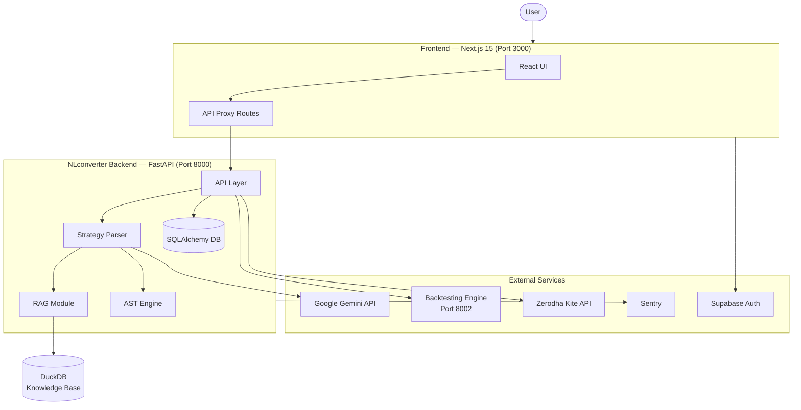
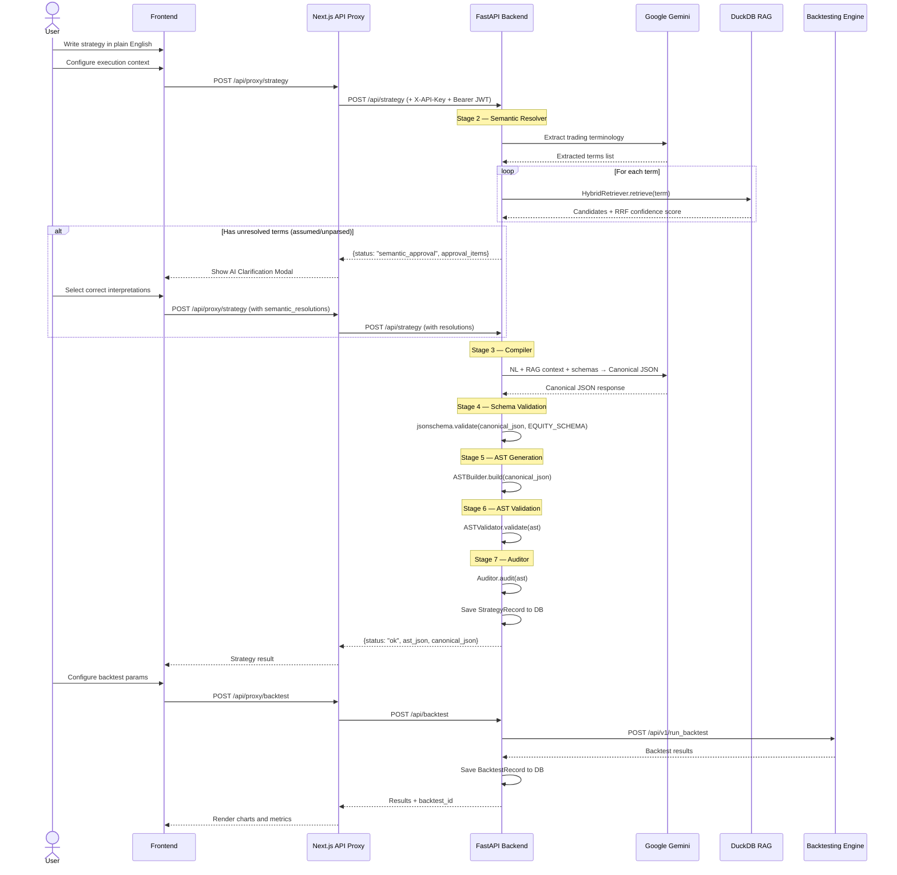
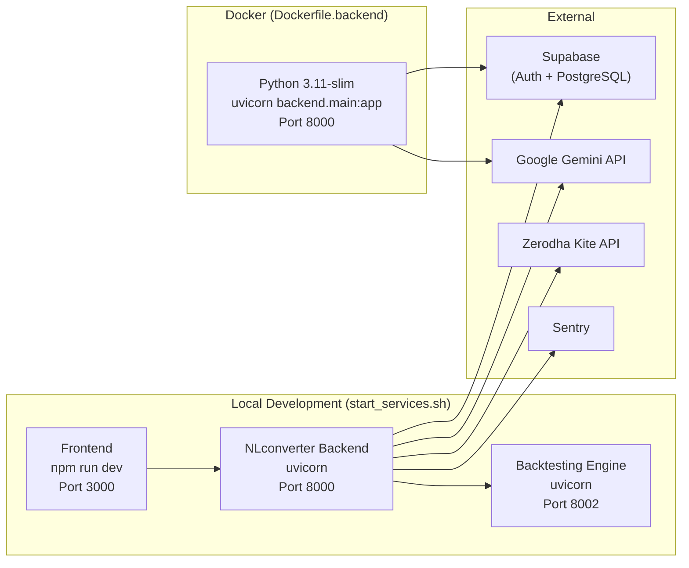

# System Architecture Document

| Field          | Value                                  |
|----------------|----------------------------------------|
| **Project**    | TradeKaro — NLconverter                |
| **Doc Type**   | System Architecture Document           |
| **Version**    | 1.0.0                                  |
| **Author**     | TradeKaro Team                         |
| **Last Updated** | 2026-09-02                           |

---

## 1. Architecture Goals

1. **Determinism** — Same input always produces the same AST. The LLM handles ambiguity; everything downstream is rule-based.
2. **Separation of Concerns** — Parsing (NL → JSON) is separated from compilation (JSON → AST) which is separated from execution (Backtesting Engine).
3. **Extensibility** — New indicators, node types, and knowledge docs can be added without modifying core pipeline code.
4. **Security** — API keys never reach the browser; all backend calls are proxied through Next.js server-side routes.

---

## 2. System Context Diagram



---

## 3. Technology Stack

### Frontend

| Technology         | Version | Purpose                                    |
|--------------------|---------|-------------------------------------------|
| Next.js            | 15.5    | React framework with App Router, Turbopack |
| React              | 19.1    | UI component library                       |
| TypeScript         | 5.x     | Type-safe JavaScript                       |
| TailwindCSS        | 4.x     | Utility-first CSS framework                |
| Zustand            | 5.x     | Lightweight state management               |
| Recharts           | 3.x     | Charting library (equity curves, drawdown)  |
| Lightweight Charts | 5.x     | TradingView-style OHLC candlestick charts  |
| Supabase SSR       | 0.12    | Server-side auth session management         |
| Lucide React       | 1.x     | Icon library                               |
| date-fns           | 4.x     | Date utility library                       |

### Backend

| Technology          | Version    | Purpose                                    |
|---------------------|-----------|-------------------------------------------|
| Python              | 3.11      | Runtime (Docker base image)                |
| FastAPI             | 0.137     | REST API framework                         |
| Uvicorn             | 0.49      | ASGI server                                |
| Pydantic            | 2.13      | Request/response validation                |
| SQLAlchemy          | ≥2.0      | ORM and database abstraction               |
| Alembic             | ≥1.13     | Database migration tool                    |
| jsonschema          | 4.26      | JSON Schema validation (Draft 2020-12)     |
| Google Gemini API   | —         | LLM for NL → Canonical JSON (model: `gemini-3.1-flash-lite`) |
| DuckDB              | 1.5       | Embedded analytics DB for RAG knowledge base |
| sentence-transformers | —       | Local embedding model (`all-MiniLM-L6-v2`, 384-dim) |
| RapidFuzz           | 3.14      | Fuzzy string matching for typo normalization |
| Sentry SDK          | ≥1.43     | Error monitoring and tracking              |
| pandas              | ≥2.0      | Data processing (instrument lists)         |
| PyJWT               | ≥2.8      | Supabase JWT decoding and verification     |
| KiteConnect         | ≥5.0      | Zerodha broker API client                  |
| python-dotenv       | ≥1.0      | Environment variable loading               |

### Database

| Store          | Technology         | Purpose                                |
|----------------|-------------------|----------------------------------------|
| Primary        | SQLite / PostgreSQL | Strategy records, backtest records, users |
| RAG Knowledge  | DuckDB             | Indicator/term knowledge base with VSS  |

### Infrastructure

| Technology       | Purpose                              |
|------------------|--------------------------------------|
| Docker           | Backend containerization             |
| GitHub Actions   | CI pipeline (API key verification)   |

---

## 4. Component Breakdown

### 4.1 Frontend (`/frontend`)

```
frontend/src/
├── app/                    # Next.js App Router pages
│   ├── page.tsx            # Landing / redirect
│   ├── layout.tsx          # Root layout
│   ├── globals.css         # Global styles (TailwindCSS)
│   ├── strategy/           # Strategy creation page
│   ├── backtest/           # Backtest results pages
│   │   └── [id]/           # Dynamic backtest detail page
│   ├── paper-trade/        # Paper trading page
│   ├── login/              # Authentication page
│   ├── health/             # Health check page
│   └── api/                # Next.js API proxy routes
│       ├── proxy/          # Proxy to FastAPI backend
│       └── backtests/      # Backtest read endpoints
├── components/
│   ├── strategy/           # Strategy UI components
│   │   ├── NaturalLanguageEditor.tsx    # Main strategy input editor
│   │   ├── ExecutionContextForm.tsx      # Universe/timeframe/position config
│   │   ├── AIClarificationModal.tsx      # Semantic resolution modal
│   │   ├── BacktestConfigModal.tsx       # Backtest parameters form
│   │   ├── StrategySummary.tsx           # Parsed strategy display
│   │   ├── StrategyHistoryList.tsx       # Strategy history sidebar
│   │   ├── NewStrategyInterface.tsx      # Full strategy creation page
│   │   ├── CreateStrategyWizardModal.tsx # Strategy wizard
│   │   ├── AddInstrumentsModal.tsx       # Instrument picker
│   │   ├── PaperTradeConfigModal.tsx     # Paper trade config
│   │   ├── AssumptionBox.tsx             # Assumption display
│   │   └── ValidationStatus.tsx          # Validation indicator
│   ├── backtest/
│   │   └── BacktestHistoryList.tsx       # Backtest history list
│   ├── layout/
│   │   ├── Header.tsx / InnerHeader.tsx  # App headers
│   │   ├── Sidebar.tsx                   # Navigation sidebar
│   │   ├── BottomBar.tsx                 # Bottom navigation
│   │   └── DashboardLayout.tsx           # Layout wrapper
│   ├── charts/             # Chart components
│   ├── controls/           # UI control components
│   ├── dashboard/          # Dashboard components
│   ├── metrics/            # Metrics display
│   ├── papertrade/         # Paper trade components
│   └── trades/             # Trade list components
├── services/
│   └── api.ts              # Backend API client (all calls go through proxy)
├── store/
│   └── backtestStore.ts    # Zustand store for backtest state
├── lib/
│   ├── backendConfig.ts    # Server-side backend URL/key config
│   └── supabase/           # Supabase client and middleware helpers
├── config/                 # App configuration
└── middleware.ts            # Supabase session refresh middleware
```

**Key design decision**: All backend API calls from the browser go through Next.js API routes (`/api/proxy/*`), which inject the `X-API-Key` header server-side. No secrets are exposed to the client.

### 4.2 Backend (`/backend`)

```
backend/
├── main.py                  # FastAPI app entry point, CORS, Sentry, routing
├── requirements.txt         # Python dependencies
├── api/
│   ├── schemas.py           # Pydantic request/response models
│   ├── dependencies.py      # API key verification, rate limiting
│   ├── deps.py              # JWT auth, get_current_user dependency
│   ├── auth.py              # Kite Connect auth router
│   └── routers/
│       ├── strategies.py    # Strategy CRUD endpoints
│       ├── backtests.py     # Backtest proxy and CRUD endpoints
│       ├── instruments.py   # NSE/NFO instrument listing
│       ├── portfolio.py     # Kite portfolio positions
│       └── paper_trade.py   # Paper trade session management
├── services/
│   ├── strategy_service.py  # 7-stage pipeline orchestration
│   ├── backtest_service.py  # HTTP proxy to Backtesting Engine
│   └── utils.py             # Symbol mapping, instrument token cache
├── db/
│   ├── database.py          # SQLAlchemy engine, session, Base
│   └── models.py            # User, StrategyRecord, BacktestRecord
├── alembic/                 # Database migration scripts
├── strategy_parser/         # Core NL → AST engine
│   ├── parser/              # LLM client, strategy parser, validator
│   ├── pipeline/            # 7-stage pipeline components
│   ├── ast/                 # AST nodes, builder, serializer, utils
│   ├── rag/                 # RAG: retriever, normalizer, embeddings, models
│   ├── prompts/             # LLM system prompt
│   ├── schemas/             # JSON schemas (canonical, equity, futures, execution context)
│   └── tests/               # Parser test suite
├── data/                    # DuckDB knowledge base file
└── tests/                   # API and integration tests
```

### 4.3 Strategy Parser Pipeline

The core engine that converts natural language to AST. See section 5 for the full sequence diagram.

### 4.4 External: Backtesting Engine

A separate repository (`Backtesting_Engine`) running on port 8002. The NLconverter backend proxies requests to it via HTTP and stores results in the local database.

---

## 5. Prompt-to-Backtest Sequence Diagram



---

## 6. Storage Design

### 6.1 Primary Database (SQLAlchemy)

- **Engine**: SQLite (local development) or PostgreSQL (production via Supabase)
- **Switching**: Controlled by `DATABASE_URL` environment variable
- **PostgreSQL settings**: Connection pooling (`pool_size=5`, `max_overflow=10`), keepalives, `pool_pre_ping`
- **Migrations**: Managed via Alembic
- **Tables**: `users`, `strategies`, `backtests` — see [DATA_MODEL.md](./DATA_MODEL.md)

### 6.2 RAG Knowledge Base (DuckDB)

- **File**: `backend/data/knowledge_base.duckdb`
- **Extensions**: `vss` (vector similarity search), `fts` (full-text search)
- **Table**: `knowledge_docs` — stores indicators, terms, strategies with 384-dim embeddings
- **Embedding model**: `all-MiniLM-L6-v2` via `sentence-transformers`
- **Search**: Hybrid — dense (VSS `array_distance`) + sparse (ILIKE fallback) merged via Reciprocal Rank Fusion (k=60)
- **Confidence threshold**: RRF score ≥ 0.03 for "confident" classification

---

## 7. Deployment Topology



> **Note**: Kubernetes manifests and docker-compose files are `TODO: not yet implemented`. See [DEPLOYMENT.md](./DEPLOYMENT.md) for details.

---

## 8. Directory Structure (Full Repository)

```
NLconverter/
├── README.md
├── NL_LIMITATIONS.md
├── Dockerfile.backend
├── start_services.sh
├── generate_init.py
├── .env
├── .gitignore
├── .dockerignore
├── .github/workflows/ci.yml
├── sql_app.db                     # SQLite database (local dev)
├── documentation/                 # This documentation suite
├── frontend/                      # Next.js 15 application
│   ├── package.json
│   ├── tsconfig.json
│   ├── next.config.ts
│   ├── postcss.config.mjs
│   ├── eslint.config.mjs
│   ├── .env.local
│   ├── public/
│   └── src/                       # See §4.1
├── backend/                       # FastAPI application
│   ├── main.py
│   ├── requirements.txt
│   ├── .env / .env.example
│   ├── alembic.ini
│   ├── alembic/
│   ├── api/                       # See §4.2
│   ├── services/
│   ├── db/
│   ├── strategy_parser/
│   ├── data/
│   ├── tests/
│   └── scripts/
├── strategy_parser/               # Legacy / top-level parser (see backend/strategy_parser)
├── app/market_data/               # Market data module
└── correctcase/                   # Case correction utilities
```

---

## 9. Key Design Decisions

| Decision                          | Rationale                                                     |
|-----------------------------------|---------------------------------------------------------------|
| Generic `IndicatorNode` over indicator-specific AST classes | No `RSI_NODE`, `MACD_NODE` etc. — keeps AST extensible via configuration |
| 7-stage pipeline over monolithic LLM call | Each stage is independently testable, debuggable, and replaceable |
| RAG over static hardcoded context | Scalable entity disambiguation; new indicators added without prompt changes |
| Next.js API proxy over direct browser→backend calls | API keys stay server-side; no secrets in the browser |
| SQLAlchemy over raw DuckDB for primary storage | Relational integrity, Alembic migrations, Supabase PostgreSQL compatibility |
| DuckDB for RAG knowledge base | Embedded, zero-config, supports VSS and FTS extensions |
| System prompt with schemas embedded once | Avoids repeating ~17KB of schema in every user prompt (token optimization) |
| Blocker Detector deprecated in favor of RAG | RAG's `unparsed` state replaces the binary CLEAR/BLOCKED classification |

---

## 10. Future Direction

- **Heuristics Engine**: Translate abstract concepts (support/resistance, consolidation) to strict mathematical indicators
- **Interactive Clarification**: AI asks follow-up questions instead of blocking strategies
- **Pattern Recognition Microservice**: Dedicated service for structural chart pattern detection
- **Multi-Timeframe Resolution**: Per-indicator timeframe overrides in the AST schema
- **State Tracking**: Dynamic variables and loops for path-dependent strategies
- **RL Layer**: Reinforcement learning optimization on top of backtest results
