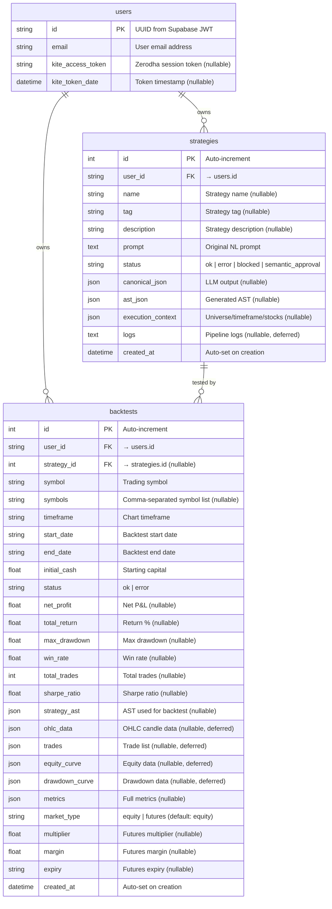

# Data Model Reference

| Field          | Value                                  |
|----------------|----------------------------------------|
| **Project**    | TradeKaro — NLconverter                |
| **Doc Type**   | Data Model Reference                   |
| **Version**    | 1.0.0                                  |
| **Author**     | TradeKaro Team                         |
| **Last Updated** | 2026-09-02                           |

---

## 1. Overview

NLconverter uses two database systems:

| Store              | Technology         | Purpose                                         |
|--------------------|--------------------|--------------------------------------------------|
| **Primary DB**     | SQLite / PostgreSQL | Users, strategies, backtests (via SQLAlchemy)    |
| **RAG Knowledge**  | DuckDB             | Indicator/term knowledge base with vector search |

The primary DB is switchable via the `DATABASE_URL` environment variable:
- **Local dev**: SQLite (`sqlite:///./sql_app.db`)
- **Production**: PostgreSQL via Supabase (`postgresql://...`)

---

## 2. Entity-Relationship Diagram



---

## 3. Table Details

### 3.1 `users`

Defined in [`backend/db/models.py`](../backend/db/models.py).

| Column              | Type             | Constraints          | Description                                   |
|---------------------|------------------|----------------------|-----------------------------------------------|
| `id`                | `String`         | **PK**               | UUID from Supabase JWT `sub` claim            |
| `email`             | `String`         | **NOT NULL**, unique  | User email from JWT `email` claim             |
| `kite_access_token` | `String`         | Nullable             | Zerodha Kite session access token             |
| `kite_token_date`   | `DateTime`       | Nullable             | Timestamp when Kite token was obtained        |

**Notes**:
- Users are auto-created on first authenticated API call (see [`deps.py`](../backend/api/deps.py) → `get_current_user()`)
- `kite_access_token` expires daily at midnight IST (Zerodha policy)
- The `kite_token_date` is checked against midnight IST to determine session validity

### 3.2 `strategies`

Defined in [`backend/db/models.py`](../backend/db/models.py).

| Column               | Type             | Constraints          | Description                                   |
|----------------------|------------------|----------------------|-----------------------------------------------|
| `id`                 | `Integer`        | **PK**, auto-increment | Unique strategy ID                          |
| `user_id`            | `String`         | **FK → users.id**    | Owning user                                   |
| `name`               | `String`         | Nullable             | Strategy name                                 |
| `tag`                | `String`         | Nullable             | Categorization tag                            |
| `description`        | `Text`           | Nullable             | Strategy description                          |
| `prompt`             | `Text`           | **NOT NULL**         | Original natural language prompt              |
| `status`             | `String`         | **NOT NULL**         | Pipeline result status                        |
| `canonical_json`     | `JSON`           | Nullable             | Compiled Canonical JSON from LLM              |
| `ast_json`           | `JSON`           | Nullable             | Generated AST (tree structure)                |
| `execution_context`  | `JSON`           | Nullable             | Merged execution context (universe, timeframe, etc.) |
| `logs`               | `Text`           | Nullable, **deferred** | Full pipeline logs (not loaded by default)   |
| `created_at`         | `DateTime`       | Auto-set             | Creation timestamp                            |

**Status enum values**:

| Value                | Meaning                                                     |
|----------------------|-------------------------------------------------------------|
| `ok`                 | All 7 pipeline stages passed                                |
| `error`              | Pipeline failed at some stage                               |
| `blocked`            | Strategy contains concepts that cannot be compiled (deprecated) |
| `semantic_approval`  | RAG found assumed/unparsed terms — awaiting user resolution |

**Deferred columns**: The `logs` column uses SQLAlchemy's `deferred()` to avoid loading large text data in list queries. It's only fetched when explicitly accessed.

### 3.3 `backtests`

Defined in [`backend/db/models.py`](../backend/db/models.py).

| Column               | Type             | Constraints          | Description                                   |
|----------------------|------------------|----------------------|-----------------------------------------------|
| `id`                 | `Integer`        | **PK**, auto-increment | Unique backtest ID                          |
| `user_id`            | `String`         | **FK → users.id**    | Owning user                                   |
| `strategy_id`        | `Integer`        | **FK → strategies.id**, Nullable | Linked strategy                  |
| `symbol`             | `String`         | Nullable             | Primary trading symbol                        |
| `symbols`            | `String`         | Nullable             | Comma-separated list of symbols               |
| `timeframe`          | `String`         | Nullable             | Chart timeframe (1m, 5m, 1d, etc.)           |
| `start_date`         | `String`         | Nullable             | Backtest start date (YYYY-MM-DD)              |
| `end_date`           | `String`         | Nullable             | Backtest end date (YYYY-MM-DD)                |
| `initial_cash`       | `Float`          | Nullable             | Starting capital                              |
| `status`             | `String`         | Nullable             | `ok` or `error`                               |
| `net_profit`         | `Float`          | Nullable             | Net P&L                                       |
| `total_return`       | `Float`          | Nullable             | Return percentage                             |
| `max_drawdown`       | `Float`          | Nullable             | Maximum drawdown                              |
| `win_rate`           | `Float`          | Nullable             | Winning trade percentage                      |
| `total_trades`       | `Integer`        | Nullable             | Total number of trades                        |
| `sharpe_ratio`       | `Float`          | Nullable             | Risk-adjusted return metric                   |
| `strategy_ast`       | `JSON`           | Nullable             | AST JSON used (reproducibility)               |
| `ohlc_data`          | `JSON`           | Nullable, **deferred** | OHLC candle data                            |
| `trades`             | `JSON`           | Nullable, **deferred** | Individual trade records                    |
| `equity_curve`       | `JSON`           | Nullable, **deferred** | Portfolio equity over time                  |
| `drawdown_curve`     | `JSON`           | Nullable, **deferred** | Drawdown percentage over time               |
| `metrics`            | `JSON`           | Nullable             | Full metrics from Backtesting Engine          |
| `market_type`        | `String`         | Default: `"equity"`  | `equity` or `futures`                         |
| `multiplier`         | `Float`          | Nullable             | Futures contract multiplier                   |
| `margin`             | `Float`          | Nullable             | Futures margin requirement                    |
| `expiry`             | `String`         | Nullable             | Futures contract expiry date                  |
| `created_at`         | `DateTime`       | Auto-set             | Creation timestamp                            |

**Deferred columns**: `ohlc_data`, `trades`, `equity_curve`, `drawdown_curve` are deferred to avoid loading potentially megabytes of JSON in list queries. They're fetched on individual backtest detail requests using `undefer()`.

---

## 4. Strategy JSON Schema

The intermediate Canonical JSON produced by the LLM compiler is validated against strict JSON Schemas (Draft 2020-12).

### 4.1 Schema Files

| File                          | Purpose                                | Used When                |
|-------------------------------|----------------------------------------|--------------------------|
| [`EQUITY_SCHEMA.json`](../backend/strategy_parser/schemas/EQUITY_SCHEMA.json) | Equity strategy validation | `market_type == "equity"` |
| [`FUTURES_SCHEMA.json`](../backend/strategy_parser/schemas/FUTURES_SCHEMA.json) | Futures strategy validation | `market_type == "futures"` |
| [`EQUITY_EXECUTION_CONTEXT_SCHEMA.json`](../backend/strategy_parser/schemas/EQUITY_EXECUTION_CONTEXT_SCHEMA.json) | Execution context validation | Always (context merge) |
| [`canonical_schema.json`](../backend/strategy_parser/schemas/canonical_schema.json) | Template/example schema (reference) | Development reference |

### 4.2 Canonical JSON Top-Level Structure

```json
{
  "signals": {
    "indicators": [ ... ]
  },
  "operation": [
    {
      "entry": [ ... ],
      "exit": [ ... ]
    }
  ],
  "risk": {
    "stop_loss": { ... },
    "take_profit": { ... },
    "trailing_stop": { ... },
    "risk_reward": { ... },
    "position_size": { ... },
    "portfolio_constraints": { ... }
  }
}
```

### 4.3 Signals — Indicator Definition

```json
{
  "id": "indicator_1",
  "name": "RSI",
  "params": {"period": 14, "source": "close"},
  "input_node": null
}
```

| Field         | Type            | Required | Description                                                |
|---------------|-----------------|----------|------------------------------------------------------------|
| `id`          | `string`        | ✅       | Unique ID referenced by condition operands (e.g., `"indicator_1"`) |
| `name`        | `string`        | ✅       | Canonical indicator name (any string, e.g., `"RSI"`, `"KNOXVILLE_DIVERGENCE"`) |
| `params`      | `object`        | ✅       | Indicator parameters (e.g., `{"period": 14}`)             |
| `input_node`  | `operand\|null` |          | Optional custom input data (arithmetic expression tree)    |

### 4.4 Operation — Condition Tree Nodes

Conditions form a recursive tree structure. Each node has a `type` that determines its behavior:

**Logical node types** (group child nodes):

| Type     | Behavior                        |
|----------|--------------------------------|
| `AND`    | All children must be true      |
| `OR`     | Any child must be true         |
| `NOT`    | Inverts child condition         |

**Comparison node types** (compare operand_1 vs operand_2):

| Type                | Behavior              |
|---------------------|-----------------------|
| `GREATER_THAN`      | `op1 > op2`           |
| `LESS_THAN`         | `op1 < op2`           |
| `GREATER_THAN_EQUAL`| `op1 >= op2`          |
| `LESS_THAN_EQUAL`   | `op1 <= op2`          |
| `EQUAL`             | `op1 == op2`          |
| `NOT_EQUAL`         | `op1 != op2`          |

**Crossover node types**:

| Type           | Behavior                          |
|----------------|----------------------------------|
| `CROSS_ABOVE`  | `op1` crosses above `op2`        |
| `CROSS_BELOW`  | `op1` crosses below `op2`        |

**Temporal node types**:

| Type          | Behavior                 |
|---------------|--------------------------|
| `TIME`        | Time-of-day condition    |
| `DATE`        | Specific date condition  |
| `SESSION`     | Trading session filter   |
| `DAY_OF_WEEK` | Day-of-week filter       |

**Special node types**:

| Type          | Fields                                  | Behavior                                      |
|---------------|----------------------------------------|-----------------------------------------------|
| `FOLLOWED_BY` | `setup_condition`, `trigger_condition`, `max_bars_between` | State machine: setup arms, trigger fires within N bars |
| `SEQUENCE`    | `direction`, `count`, `condition`       | Check if condition holds for N consecutive bars |

### 4.5 Operand Types

| Type          | Key Fields                          | Description                          |
|---------------|-------------------------------------|--------------------------------------|
| `indicator`   | `indicator_id`, `property`          | Reference to a signal indicator      |
| `market_data` | `data_type`, `lookback`             | Raw price/volume (CLOSE, OPEN, HIGH, LOW, VOLUME) |
| `constant`    | `value`                             | Literal number, string, or boolean   |
| `pattern`     | `pattern_type`, `parameters`, `lookback_periods` | Chart pattern detection   |
| `arithmetic`  | `operator`, `operand_1`, `operand_2` | Arithmetic expression tree (ADD, SUBTRACT, MULTIPLY, DIVIDE, MIN, MAX, ABS) |

### 4.6 Risk Management

| Section               | Fields                                                            |
|-----------------------|-------------------------------------------------------------------|
| `stop_loss`           | `type`, `value`, `reference`, `direction`, `atr_multiple`, `price_level`, `indicator_ref` |
| `take_profit`         | `type`, `value`, `target_indicator`, `price_level`, `risk_reward_ratio` |
| `trailing_stop`       | `type`, `value`, `trail_amount`, `reference`, `indicator_ref`     |
| `risk_reward`         | `type`, `ratio`, `value`                                         |
| `position_size`       | `type`, `value`, `max_size`, `min_size`                           |
| `portfolio_constraints` | `max_drawdown`, `max_drawdown_percent`, `max_daily_loss`, `max_loss_amount`, `max_open_trades`, `max_trades`, `capital_allocation`, `allocation_percent` |

All risk fields are nullable — the schema accepts `null` for any field not mentioned in the user's prompt. Values are **never invented** by the compiler; they come from user input only.

### 4.7 Execution Context

Validated against [`EQUITY_EXECUTION_CONTEXT_SCHEMA.json`](../backend/strategy_parser/schemas/EQUITY_EXECUTION_CONTEXT_SCHEMA.json):

```json
{
  "execution_context": {
    "universe": {
      "asset_class": "equity",
      "index": "NIFTY 50",
      "exchange": "NSE"
    },
    "timeframe": "1d",
    "position_side": "LONG",
    "order_type": "MAK",
    "stocks": ["RELIANCE", "TCS", "INFY"]
  }
}
```

| Field          | Type     | Required | Enum Values                                  |
|----------------|----------|----------|----------------------------------------------|
| `asset_class`  | `string` | ✅       | `equity`, `futures`, `options`, `commodity`, `currency` |
| `timeframe`    | `string` | ✅       | `1m`, `2m`, `5m`, `15m`, `30m`, `1h`, `1d`, `1wk`, `1mo` |
| `position_side`| `string` | ✅       | `LONG`, `SHORT`, `BOTH`                      |
| `order_type`   | `string` |          | `MAK`, `LIMIT`, `STOP`, `STOP_LIMIT`         |
| `stocks`       | `string[]` | ✅     | List of stock symbols                        |

---

## 5. Semantic Resolution — Parsed / Assumed / Unparsed

The `SemanticResolver` pipeline stage classifies each extracted trading term using the RAG knowledge base.

Defined in [`semantic_resolver.py`](../backend/strategy_parser/pipeline/semantic_resolver.py) as `ApprovalItem`:

| Field        | Type        | Description                                           |
|--------------|-------------|-------------------------------------------------------|
| `type`       | `string`    | Classification: `"parsed"`, `"assumed"`, or `"unparsed"` |
| `source`     | `string`    | The original term extracted from the user's prompt    |
| `candidates` | `string[]`  | Possible canonical resolutions from RAG retrieval     |
| `confidence` | `float`     | RRF confidence score (0.0 – 1.0)                     |
| `context`    | `string`    | Additional context from the RAG knowledge base        |

**Classification logic**:

| Type         | Condition                                              | User Action                  |
|--------------|--------------------------------------------------------|------------------------------|
| `parsed`     | RRF score ≥ threshold (0.03) and single clear match    | None — auto-resolved         |
| `assumed`    | RRF score ≥ threshold but ambiguous or multiple matches | User selects correct option  |
| `unparsed`   | RRF score < threshold or no matches                     | User provides clarification  |

When `assumed` or `unparsed` items exist, the API returns `status: "semantic_approval"` and the frontend shows the AI Clarification Modal.

---

## 6. RAG Knowledge Base (DuckDB)

### 6.1 Table: `knowledge_docs`

Stored in `backend/data/knowledge_base.duckdb`. Schema defined in [`rag/__init__.py`](../backend/strategy_parser/rag/__init__.py):

| Column          | Type            | Description                                      |
|-----------------|-----------------|--------------------------------------------------|
| `id`            | `VARCHAR`       | Unique ID (e.g., `"ind_rsi"`, `"term_breakout"`) |
| `type`          | `VARCHAR`       | Document type: `"indicator"`, `"term"`, `"strategy"` |
| `canonical_name`| `VARCHAR`       | Proper canonical name                            |
| `aliases`       | `VARCHAR[]`     | Alternative names and common typos               |
| `maps_to_field` | `VARCHAR`       | Exact-match filtering field (nullable)           |
| `embedding_text`| `VARCHAR`       | Natural language text that was embedded           |
| `metadata`      | `JSON`          | Additional structured properties                 |
| `vec`           | `FLOAT[384]`    | 384-dimensional embedding vector                 |

### 6.2 Pydantic Model: `KnowledgeDoc`

Defined in [`rag/models.py`](../backend/strategy_parser/rag/models.py):

```python
class KnowledgeDoc(BaseModel):
    id: str
    type: str
    canonical_name: str
    aliases: List[str] = []
    maps_to_field: Optional[str] = None
    embedding_text: str
    metadata: Dict[str, Any] = {}
```

### 6.3 Embedding Model

- **Model**: `all-MiniLM-L6-v2` via `sentence-transformers`
- **Dimensions**: 384
- **Loaded**: At module level, cached globally (see [`rag/embedding.py`](../backend/strategy_parser/rag/embedding.py))

### 6.4 Search Architecture

| Component      | Method                      | Implementation              |
|----------------|-----------------------------|-----------------------------|
| Dense search   | VSS (`array_distance`)      | DuckDB `vss` extension      |
| Sparse search  | `ILIKE` keyword matching    | Fallback for FTS persistence issues |
| Fusion         | Reciprocal Rank Fusion (k=60) | Merges dense + sparse rankings |
| Gating         | Confidence threshold ≥ 0.03 | Top result must clear threshold |

---

## 7. AST Node Type Registry

The AST is a deterministic, tree-structured representation of a strategy built by `ASTBuilder` from Canonical JSON. All node types are defined in [`ast/ast_nodes.py`](../backend/strategy_parser/ast/ast_nodes.py).

For the full AST node hierarchy, type system, and serialization format, see [AST_ARCHITECTURE_DESIGN.md](./AST_ARCHITECTURE_DESIGN.md).

---

## 8. Database Migrations (Alembic)

Alembic configuration is in [`backend/alembic/`](../backend/alembic/).

### Common Commands

```bash
cd backend

# Create a new migration
alembic revision --autogenerate -m "description of change"

# Apply all pending migrations
alembic upgrade head

# Rollback one migration
alembic downgrade -1

# View current migration status
alembic current
```

### Configuration

- Config file: [`backend/alembic.ini`](../backend/alembic.ini)
- Environment setup: [`backend/alembic/env.py`](../backend/alembic/env.py) — uses the same `DATABASE_URL` as the application
- Migration scripts: `backend/alembic/versions/`
