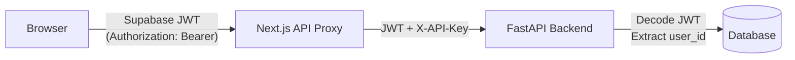

# Security Guide

| Field          | Value                                  |
|----------------|----------------------------------------|
| **Project**    | TradeKaro — NLconverter                |
| **Doc Type**   | Security Guide                         |
| **Version**    | 1.0.0                                  |
| **Author**     | TradeKaro Team                         |
| **Last Updated** | 2026-09-02                           |

---

## 1. Authentication Architecture

NLconverter uses a **dual authentication** model:



### 1.1 Supabase JWT (User Identity)

- **Provider**: Supabase Auth
- **Token format**: JWT (HS256 signed)
- **Audience**: `authenticated`
- **Claims used**: `sub` (user UUID), `email` (user email)
- **Session management**: Supabase SSR middleware refreshes sessions on each request (see [`frontend/src/middleware.ts`](../frontend/src/middleware.ts))

**Backend verification** (see [`backend/api/deps.py`](../backend/api/deps.py)):

```python
def get_current_user(credentials, db) -> User:
    token = credentials.credentials
    supabase_jwt_secret = os.getenv("SUPABASE_JWT_SECRET", "")
    
    if not supabase_jwt_secret:
        # WARNING: Signature verification SKIPPED
        payload = jwt.decode(token, options={"verify_signature": False})
    else:
        payload = jwt.decode(token, supabase_jwt_secret, algorithms=["HS256"], audience="authenticated")
```

> [!CAUTION]
> **Known Security Gap**: When `SUPABASE_JWT_SECRET` is not set (local dev), JWT signature verification is **completely disabled**. Any JWT with valid structure will be accepted. This is documented in the code with a warning comment but is a significant risk if deployed to production without the secret.

**Auto-provisioning**: If a JWT is valid but the user doesn't exist in the local database, a new `User` record is automatically created with the UUID and email from the token.

### 1.2 API Key (Service Authentication)

- **Header**: `X-API-Key`
- **Validation**: Static comparison against `API_KEY` environment variable
- **Scope**: Required for all `/api/*` endpoints (strategy, backtest, paper trade)
- **Error**: `403 Forbidden` if missing or invalid
- **Implementation**: [`backend/api/dependencies.py`](../backend/api/dependencies.py) → `verify_api_key()`

> [!IMPORTANT]
> The `API_KEY` environment variable is **required** at startup. If not set, the backend will crash with `RuntimeError: FATAL: API_KEY environment variable is not set`.

### 1.3 How API Keys Stay Secret

The frontend **never sends** the `API_KEY` directly. Instead:

1. Browser makes requests to Next.js API routes (`/api/proxy/*`)
2. Next.js server-side route reads `BACKEND_API_KEY` from `.env.local` (see [`backendConfig.ts`](../frontend/src/lib/backendConfig.ts))
3. Next.js injects the `X-API-Key` header and proxies the request to FastAPI
4. The API key never appears in browser network traffic

---

## 2. Rate Limiting

**Implementation**: [`backend/api/dependencies.py`](../backend/api/dependencies.py) → `check_rate_limit()`

| Setting                    | Environment Variable         | Default |
|---------------------------|------------------------------|---------|
| Time window               | `RATE_LIMIT_DURATION`        | 60 sec  |
| Max requests per window   | `MAX_REQUESTS_PER_DURATION`  | 10      |

- **Scope**: Per client IP address (`request.client.host`)
- **Response on exceed**: `429 Too Many Requests`
- **Storage**: In-memory `defaultdict(list)` — timestamps per IP
- **Stale cleanup**: IPs with >1000 entries are pruned when entries exceed the time window

> [!NOTE]
> Rate limiting state is in-memory and resets on server restart. It does not persist across multiple backend instances. For production with multiple replicas, consider a Redis-backed rate limiter.

---

## 3. CORS Policy

**Implementation**: [`backend/main.py`](../backend/main.py)

```python
origins_str = os.getenv("CORS_ALLOWED_ORIGINS", "http://localhost:3000")
origins = [o.strip() for o in origins_str.split(",")]

app.add_middleware(
    CORSMiddleware,
    allow_origins=origins,
    allow_credentials=True,
    allow_methods=["*"],
    allow_headers=["*"],
)
```

| Setting              | Value                                              |
|----------------------|----------------------------------------------------|
| Allowed origins      | Configurable via `CORS_ALLOWED_ORIGINS` (comma-separated) |
| Default              | `http://localhost:3000`                             |
| Credentials          | ✅ Allowed                                          |
| Methods              | All (`*`)                                          |
| Headers              | All (`*`)                                          |

---

## 4. SSRF Prevention

**Implementation**: [`backend/strategy_parser/parser/llm_client.py`](../backend/strategy_parser/parser/llm_client.py)

The LLM client validates outbound request URLs to prevent SSRF attacks:

```python
ALLOWED_DOMAINS = [
    "generativelanguage.googleapis.com",
]

parsed = urlparse(url)
if parsed.hostname not in ALLOWED_DOMAINS:
    raise ValueError(f"Blocked request to unauthorized domain: {parsed.hostname}")
```

Only `generativelanguage.googleapis.com` (Google Gemini API) is allowed. Any attempt to redirect or alter the LLM endpoint to an attacker-controlled domain is blocked.

---

## 5. Secrets Management

### Current Approach

Secrets are managed via `.env` files:

| Secret                    | File            | Purpose                                 |
|---------------------------|-----------------|-----------------------------------------|
| `GOOGLE_GEMINI_API_KEY`   | `backend/.env`  | Google Gemini LLM API key               |
| `API_KEY`                 | `backend/.env`  | Backend API key for X-API-Key header    |
| `SUPABASE_JWT_SECRET`     | `backend/.env`  | JWT signature verification secret       |
| `KITE_API_KEY`            | `backend/.env`  | Zerodha Kite API key                    |
| `KITE_API_SECRET`         | `backend/.env`  | Zerodha Kite API secret                 |
| `DATABASE_URL`            | `backend/.env`  | PostgreSQL connection string            |
| `SENTRY_DSN`              | `backend/.env`  | Sentry error tracking DSN              |
| `BACKEND_API_KEY`         | `frontend/.env.local` | API key for Next.js → FastAPI proxy |
| `BACKEND_URL`             | `frontend/.env.local` | FastAPI backend URL                 |
| `NEXT_PUBLIC_SUPABASE_URL` | `frontend/.env.local` | Supabase project URL              |
| `NEXT_PUBLIC_SUPABASE_ANON_KEY` | `frontend/.env.local` | Supabase public anon key     |

### .gitignore Protection

The following patterns are in `.gitignore`:

```
.env
.env.local
```

### CI/CD Secrets

GitHub Actions uses repository secrets:
- `GOOGLE_GEMINI_API_KEY` — used in the CI workflow for API key verification

> [!WARNING]
> **No dedicated secrets manager** (e.g., AWS Secrets Manager, HashiCorp Vault, GCP Secret Manager) is currently used. All secrets are stored in plain-text `.env` files on disk. For production deployment, migrating to a secrets manager is strongly recommended.

---

## 6. Known Security Gaps

> [!CAUTION]
> The following are honest assessments of current security gaps. They should be addressed before any production deployment.

| # | Gap | Severity | Location | Details |
|---|-----|----------|----------|---------|
| 1 | JWT verification disabled in local dev | **Critical** | [`deps.py:34`](../backend/api/deps.py) | When `SUPABASE_JWT_SECRET` is empty, any JWT is accepted |
| 2 | Hardcoded path in Kite callback | **High** | [`auth.py:71`](../backend/api/auth.py) | Writes Kite access token to `/Users/binit/Backtesting_Engine/.env` — absolute path, wrong user |
| 3 | In-memory rate limiting | **Medium** | [`dependencies.py`](../backend/api/dependencies.py) | Resets on restart, not shared across replicas |
| 4 | No secrets manager | **Medium** | All `.env` files | Secrets stored in plain-text files on disk |
| 5 | CORS allows all methods and headers | **Low** | [`main.py`](../backend/main.py) | `allow_methods=["*"]`, `allow_headers=["*"]` is overly permissive |
| 6 | No input sanitization on LLM prompts | **Low** | [`strategy_service.py`](../backend/services/strategy_service.py) | User prompts are passed directly to LLM; mitigated by immutable system prompt |

---

## 7. Error Monitoring (Sentry)

**Implementation**: [`backend/main.py`](../backend/main.py)

```python
sentry_dsn = os.getenv("SENTRY_DSN")
if sentry_dsn:
    import sentry_sdk
    sentry_sdk.init(dsn=sentry_dsn, send_default_pii=True)
```

- **PII**: Enabled (`send_default_pii=True`) — user emails and IPs may be captured
- **Conditional**: Only initialized if `SENTRY_DSN` environment variable is set
- **Scope**: All unhandled exceptions in the FastAPI application
