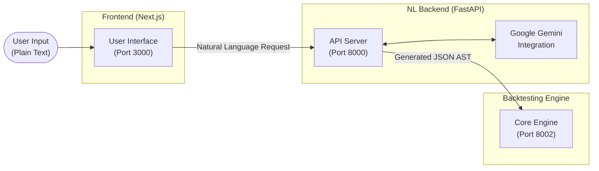

# NLconverter (Natural Language to AST)

Welcome to the **NLconverter** repository! This system is a powerful, AI-driven bridge that translates human-readable trading strategies (Natural Language) into a strict JSON Abstract Syntax Tree (AST) that can be executed by our Backtesting Engine.


## System Architecture

The repository is split into a modern web frontend and an AI-powered Python backend.



### Components
1. **Frontend (`/frontend`)**: A React/Next.js interface allowing users to select instruments, define backtest parameters, and write strategy logic in plain English.
2. **Backend (`/backend`)**: A FastAPI service that securely communicates with the Google Gemini API to parse natural language and format it into our strict AST schema.

---

## Getting Started

### 1. API Key Setup
The backend requires a Google Gemini API key to function. We use local environment variables for security.

1. Copy `.env.example` to `.env` in the root folder:
   ```bash
   cp .env.example .env
   ```
2. Open `.env` and replace the placeholder with your actual Gemini API key:
   ```text
   GOOGLE_GEMINI_API_KEY=your_real_google_gemini_api_key_here
   ```
> [!WARNING] 
> Never commit your `.env` file to GitHub. It is ignored by `.gitignore` by default. For CI/CD, use GitHub Actions Secrets.

### 2. Running the Full Stack
We have provided a unified script to spin up the entire ecosystem (NLconverter Frontend, NLconverter Backend, and the Backtesting Engine) all at once.

1. Ensure the `Backtesting_Engine` repository is located alongside this folder.
2. Run the start script:
   ```bash
   ./start_services.sh
   ```

**Services Started:**
| Service | Technology | URL |
|---------|------------|-----|
| Frontend | Next.js | `http://localhost:3000` |
| NL Backend | FastAPI | `http://localhost:8000` |
| Backtest Engine | FastAPI | `http://localhost:8002` |

---

## Prompt-to-AST Workflow

You can also test the conversion pipeline directly via CLI scripts without starting the full web stack.

**Example command:**
```bash
python3 strategy_to_ast.py --strategy "Buy when RSI drops below 30" --settings-json settings.json --ast-json
```

To verify your Gemini environment is working correctly before starting the server, run:
```bash
python3 verify_gemini_env.py
```

## Documentation

TradeKaro NLconverter includes a comprehensive documentation suite:

### Phase 1: Foundation
- [Project Requirements Document (PRD)](./PRD.md)
- [System Architecture](./ARCHITECTURE.md)
- [Contributing Guide](./CONTRIBUTING.md)

### Phase 2: Technical Reference
- [API Reference](./API_REFERENCE.md)
- [Data Model & Schema](./DATA_MODEL.md)
- [Security Guide](./SECURITY.md)
- [Deployment Guide](./DEPLOYMENT.md)

### Phase 3: User & Process Docs
- [User Guide](./USER_GUIDE.md)
- [Testing Strategy](./TESTING_STRATEGY.md)
- [Architecture Decision Records (ADRs)](./adr/README.md)
- [Changelog](./CHANGELOG.md)

### Code-Level Documentation
You can generate API and file-level documentation from the source code itself:
```bash
./documentation/generate_docs.sh
```
This generates Python docs (using `pdoc`) to `/documentation/python_docs` and TypeScript docs (using `typedoc`) to `/documentation/ts_docs`.
